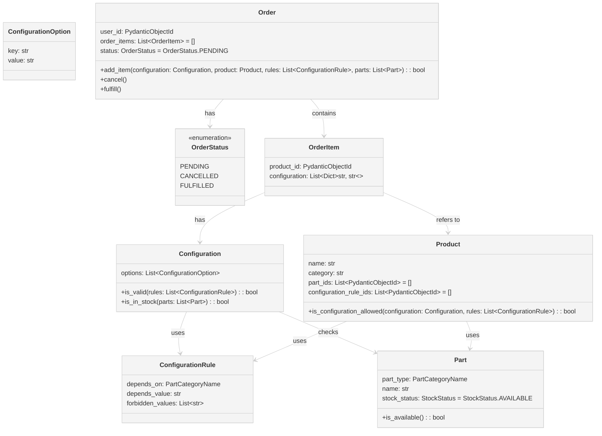

# Bicycle Shop

A web application for a bicycle shop owner, Marcus, to sell his bicycles online with customization options. The application is designed to support future expansion to other sports-related items such as skis, surfboards, roller skates, etc.

## About this project

The project requirements can be found [here](./scope.md).

## Features

### Public Part

- **Home Page**: Displays a list of bicycles available for sale.
- **Bicycle Detail Page**: Allows customers to customize their bicycles with various parts and options, and add the configured bicycle to their cart. It prevents adding bicycles with forbidden combinations or out-of-stock parts.
- **My Cart Page**: Displays the bicycles added to the cart with their configurations.

### Private Part (Admin Dashboard)

- **Manage Bicycles**: Allows the admin to create and delete bicycles.
- **Configure Bicycle Parts**: Allows the admin to manage the parts offered for each bicycle, including marking parts as temporarily out of stock.
- **Set Configuration Rules**: Allows the admin to manage the configuration policies for each bicycle.

## Tech Stack

- **Frontend**: Built with React 18, Vite and Tailwind CSS
- **Backend**: Built with Python 3.9, FastAPI, FastAPI Users
- **Database**: MongoDB
- **Containerization**: Docker

## Getting Started

### Prerequisites

- Docker
- Docker Compose

### Installation

1. Clone the repository:

   ```bash
   git clone https://github.com/micaluque0203/bicycle-shop-api.git
   cd bicycle-shop-api
   ```

2. Start the application using Docker Compose:

   ```bash
   docker-compose up --build -d
   ```

3. Populate the database

   ```bash
    docker exec -it my-mongo-container mongosh -u admin -p password docker-entrypoint-initdb.d/init-mongo.js
   ```

4. The frontend application will be accessible at `http://0.0.0.0:5173` and backend application at `http://0.0.0.0:8001/docs`.
5. To test the Admin Dashboard you can login with the following credentials:
 ```bash
   email: admin@test.com
   password: test
   ```

## API Endpoints

For detailed information on each endpoint, including request and response examples, please go to the [API documentation](http://0.0.0.0:8001/docs).

## Project Structure

```plaintext
bicycle-shop-api/
├── backend/
│   ├── Dockerfile
│   ├── requirements.txt
│   ├── src/
│   │   ├── api/ # FAST API, backend routes definition
│   │   ├── modules/
│   │   │   ├── iam/ # Users Boundary, not implemented since FastAPI Users was used due to time constraints
│   │   │   ├── orders/ # Orders Boundary module
│   │   │   ├── products/ # Product Boundary module
│   │   └── core/ # Interfaces used for Business Logic in modules
├── frontend/
│   ├── Dockerfile
│   ├── package.json
│   ├── components/ # Directory containing reusable React components
│   ├── context/ # Context API files to manage global state and context.
│   ├── hooks/ # Custom React hooks for encapsulating reusable logic
│   ├── reducers/ # Reducers for managing state changes based on actions
│   ├── pages/ # Directory containing page components for different routes in the application
│   ├── src/
│   │   ├── main.jsx # Entry point for the React application.
│   │   ├── App.jsx # Main application component that sets up routing
│   │   └── ...
├── compose.yml
└── README.md
```

## Domain-Driven Design (DDD) of the Backend



## Tradeoffs and Decisions

During the development of this project, several tradeoffs and decisions were made to balance various factors such as performance, maintainability, scalability and speed of development. Below are the key tradeoffs and decisions:

### 1. Technology Stack

Opted for a React and FastAPI stack.
While using React for the frontend allows for a highly interactive user interface and FastAPI for the backend offers fast performance and easy API creation, there may be a learning curve for developers unfamiliar with these technologies so I keep it as minimal as possible. Additionally, integrating the two can require additional setup and configuration compared to more traditional stacks.

### 2. Database Choice

Chose MongoDB as the primary database.
MongoDB offers flexibility with its schema-less design, which is great for rapid development and basic CRUD queries. However, it may result in increased complexity for relational data queries compared to SQL databases, but this is not the case for this test.

### 3. State Management

Utilized `useContext` and `useReducer` for state management in the React application.
`useContext` and `useReducer` provide a simpler and more localized state management solution than Redux but do not offer the same level of tooling and middleware support.

### 4. Styling Framework

Used Tailwind CSS for styling.
Tailwind CSS allows for rapid UI development with utility-first classes, but it can lead to verbose HTML and potentially larger bundle sizes if not purged correctly.

### 5. Authentication

Implemented JWT (JSON Web Tokens) for authentication and used FAST API users for sign in / login.
JWT offers stateless authentication, which is scalable and easy to implement. However, it requires careful handling of token expiration and security considerations but for a technical test is ok. The use of FASTAPI users for authentication is not agnostic to the framework used as if it were done using DDD.

### 6. Domain-Driven Design (DDD)

Implemented Domain-Driven Design to separate domain logic from infrastructure concerns.
DDD provides a structured approach to managing complex and scalable applications but can introduce additional complexity, and verbosity. It requires a more upfront design.

### 7. Speed of Development

Prioritized rapid development and delivery.
Some architectural and code quality compromises were made to delivery ASAP. This includes using pre-built components and libraries where applicable, which may not be fully optimized for specific use cases but allow for faster implementation.
